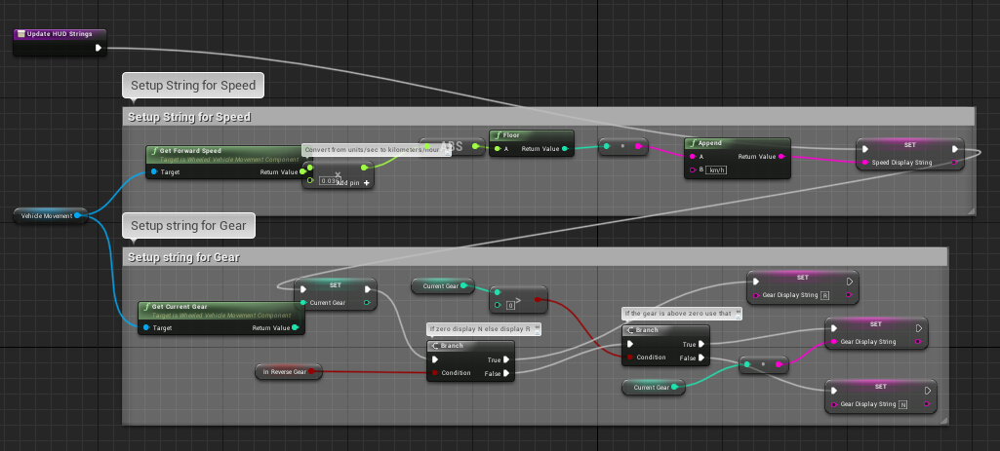

SUE4LuaSample
=============

This sample project demonstrates how to use SUE4Lua.
We have ported UE4's default template project Vehicle_BP to Lua.


Opening the Project
-------------------

You can open a project using the generated Visual Studio solution or [this](../../../SilvervineUE4Lua.code-workspace) Visual Studio Code workspace.

Since you can debug lua codes in Visual Studio Code, we highly recommend using it.

Lua Codes 
---------

You can find lua codes in Source/SUE4LuaSample/Scripts.

* Main.lua

This is the lua file that runs first when the game starts.
[Dispatch Handler Factory](HowToSetupDispatchHandlerFactory.md) and [Debugger](WorkWithVSCode.md) are configured and then some test codes are executed.

* Sedan.lua

This lua file is the ported version of the original Sedan blueprint.
The original blueprint consists of several graphs, of which the most complex event graphs are shown below.



This is converted to lua like this:

```lua
local function UpdateHUDStrings(self)
    -- Setup String for Speed
    self.SpeedDisplayString = string.format("%dkm/h",
        -- Convert from units/sec to kilometers/hour
        math.floor(math.abs(self.VehicleMovement:GetForwardSpeed() * 0.036))
    )

    -- Setup string for Gear
    if self.InReverseGear then
        self.GearDisplayString = "R"
    else
        local CurrentGear = self.VehicleMovement:GetCurrentGear()
    
        if 0 < CurrentGear then
            self.GearDisplayString = tostring(CurrentGear)
        else
            self.GearDisplayString = "N"
        end
    end
end
```

The entire codes of Sedan.lua are [here](../../../Source/SUE4LuaSample/Scripts/Sedan.lua).

* VehicleHUD.lua

This lua file is the ported version of the original VehicleHUD blueprint.
The original blueprint is shown below.


This is converted to lua like this:

```lua
function VehicleHUD:ReceiveDrawHUD(Params)
    --SUE4Lua.Log("VehicleHUD:ReceiveDrawHUD() was called.")

    local SizeX = Params.SizeX
    local SizeY = Params.SizeY

    local OwningPawn = self:GetOwningPawn()
    local Sedan = (UE4.IsValid(OwningPawn) and OwningPawn:IsA('Sedan_C')) and OwningPawn or nil
    
    if Sedan ~= nil and not Sedan.IsInCar then
        -- Calculate ratio from 720p
        local HUDXRatio, HUDYRatio = 0.0, 0.0

        HUDXRatio = SizeX / 1280.0
        HUDYRatio = SizeY / 720.0 

        -- Print vehicle speed
        self:DrawText({
            Text = Sedan.SpeedDisplayString,
            TextColor = UE4.LinearColor.new(1.0, 1.0, 1.0, 1.0),
            ScreenX = HUDXRatio * 805,
            ScreenY = HUDYRatio * 455,
            Font = self.Font,
            Scale = HUDYRatio * 1.4,
        })

        -- Print vehicle gear
        self:DrawText({
            Text = "Gear:" .. Sedan.GearDisplayString,
            TextColor = Sedan.InReverseGear and Sedan.GearDisplayReverseColor or Sedan.GearDisplayColor,
            ScreenX = HUDXRatio * 805,
            ScreenY = HUDYRatio * 500,
            Font = self.Font,
            Scale = HUDYRatio * 1.4,
        })

    end
end
```

The entire codes of VehicleHUD.lua are [here](../../../Source/SUE4LuaSample/Scripts/VehicleHUD.lua).

Bundle Files
------------

We have registered [SUE4Lua.zip](../../../Content/SUE4Lua.zip) and [Game.zip](../../../Content/Game.zip) files to help you understand the file loader.
Please see [this](HowToSetupFileLoader.md) for more information.

------------------------------------------------
[Back to Programming Guide](ProgrammingGuide.md)