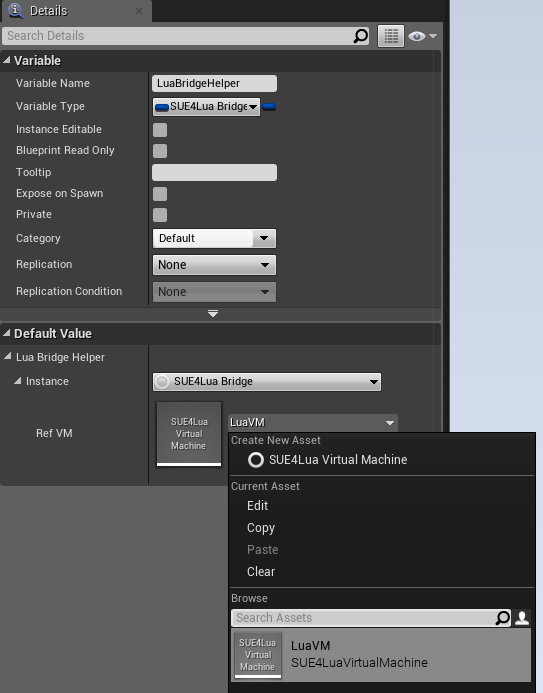
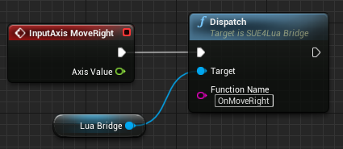

Blueprint 함수를 Lua로 구현하기
==============================

Blueprint 함수가 호출되었을 때 해당 함수에 대한 Lua 함수를 호출하고 파라메터를 자동으로 전달해주는 SUE4Lua의 기능을 _디스패치_ 라고 부르고 있습니다.
디스패치를 사용하면 Blueprint의 복잡도를 크게 낮추고 협업 가능한 상태로 만들 수 있습니다.

이 문서에서는 Blueprint에 디스패치를 적용하는 방법에 대해서 설명합니다.

준비
----

SUE4Lua가 디스패치를 처리하려면 두 가지 정보가 필요합니다.

1. Blueprint의 구현이 들어있는 Lua 파일의 이름
2. 디스패치할 Blueprint 함수의 정보

첫 번째 정보는 _디스패치 핸들러 팩토리_ 라는 Lua 함수를 통해서 얻을 수 있습니다. 자세한 사항은 [여기](HowToSetupDispatchHandlerFactory_ko.md)를 참고하세요. 

두 번째 정보는 _Lua 브릿지_ 객체로부터 얻습니다. Lua 브릿지는 `USUE4LuaBridge` 형식의 UObject 객체입니다. 
디스패치를 사용하려면 반드시 Lua 브릿지를 Blueprint에 변수로 추가해야 합니다.

다음과 같이 Lua 브릿지를 Blueprint의 변수로 추가하세요. 보통의 Blueprint 변수 추가와 동일합니다.


그 다음, `USUE4LuaBridgeHelper` 형식의 _Lua 브릿지 헬퍼_ 변수를 추가합니다. 이 변수는 Lua 브릿지 변수를 초기화를 쉽게 해주는 헬퍼 객체 입니다.

변수를 추가하고 컴파일한 후에 아래와 같이 RefVM의 기본값으로 VM 어셋을 설정해주세요. 아직 VM 어셋을 만들지 않았다면 [여기](HowToCreateVMAsset_ko.md)를 참고해서 생성해주세요.



이제, Lua 브릿지를 초기화하는 Blueprint 코드를 작성합니다. `BeginPlay`에 넣는 것이 일반적입니다. 


마지막으로 Lua 파일(저희는 이 파일을 _디스패치 핸들러_ 라고 부르고 있습니다)을 열고 아래와 같은 코드를 작성합니다. 아직 Lua 파일이 없다면 [여기](HowToSetupDispatchHandlerFactory_ko.md)를 참고해서 생성해주세요.
```lua
local MyClass = Class()

return MyClass
```

디스패치를 하기 위한 모든 준비를 완료했습니다!

참고:
* 위의 Lua 코드 예시에서 MyClass는 Blueprint 클래스 이름과 같을 필요가 없습니다. 그러나 같은 이름을 사용해야 코드를 이해하기 쉽습니다. 

디스패치하기
-----------

원하는 Blueprint 함수의 그래프를 열고 아래와 같은 Blueprint 코드를 작성합니다.


그리고 디스패치 핸들러로 이동하여 함수를 구현합니다. 함수 이름은 반드시 Blueprint 함수 이름과 같아야 합니다.

```lua
function MyClass:NewFunction(Params)
    SUE4Lua.Log("Hello, World")
end
```

이제 Blueprint에서 `NewFunction()`을 호출하면 출력창에 "Hello, World" 가 출력됩니다.
Blueprint 뿐만 아니라 Lua에서 NewFunction()을 호출해도 잘 동작합니다.

참고:
* `BeginPlay`나 `Tick`과 같이 디스플레이 이름과 실제 이름이 다른 함수는 실제 이름(`ReceiveBeginPlay`, `ReceiveTick`)을 사용해야 합니다.
* SUE4Lua가 출력하는 오류 메시지에 실제 이름이 출력되니 참고하세요. 
```
LogSUE4L: Error: [LuaVM] [USUE4LuaBridge::DispatchInternal] DispatchHandler is not found: Sedan_C.ReceiveBeginPlay
```

파라메터 전달
------------

Blueprint 함수에 파라메터를 선언만 하면 자동으로 Lua에 전달됩니다.


위와 같은 함수의 파라메터는 Lua에서 이렇게 쓸 수 있습니다.
```lua
function MyClass:NewFunction(Params)
    -- Input
    local NewParam = Params.NewParam
    local NewParam1 = Params.NewParam1
    local NewParam2 = Params.NewParam2
    local NewParam3 = Params.NewParam3
    local NewParam4 = Params.NewParam4
    local NewParam5 = Params.NewParam5

    -- You can call UFunctions with self
    self:SomeNativeFunction(123)
    self:SomeBlueprintFunction(456)

    -- Output
    Params.NewParams6 = ...
    Params.NewParams7 = ...
end
```

출력값은 Lua 함수에서 반환하는 것이 아니라 _Params_ 에 저장해야 하는 것에 주의하시기 바랍니다.

**주의**

반환 노드를 그래프에 연결하시면 안됩니다. 반환노드가 그래프에 연결되어 있으면 Lua 함수에서 출력한 값이 무시됩니다.

이벤트의 디스패치
----------------

이벤트 그래프의 이벤트도 디스패치할 수 있습니다. 방법은 함수와 동일합니다.


이름이 복잡하거나 _에디터가 자동 생성한 이름을 가진_ 이벤트라면 디스패치 노드의 `FunctionName` 값을 지정하시면 편리합니다. 



```lua
function Sedan:OnMoveRight(Params)
    --SUE4Lua.Log("Sedan:OnMoveRight() was called.")

    local AxisValue = Params.AxisValue

    -- Steering inupt
    self.VehicleMovement:SetSteeringInput(AxisValue)
end
```

위 이벤트의 실제 이름은 `InpAxisEvt_MoveRight_K2Node_InputAxisEvent_15` 입니다(숫자는 다를 수 있습니다).

----------------------------------------------------
[프로그래밍 가이드](ProgrammingGuide_ko.md)로 돌아가기