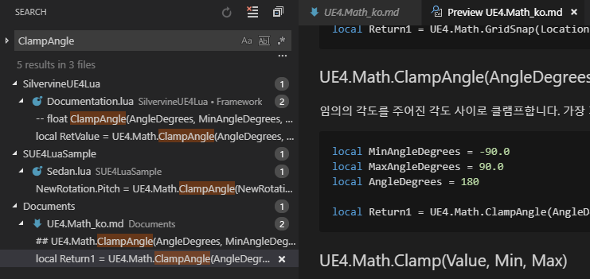

Working with Visual Studio Code
===============================

You can write and **DEBUG** your lua code using Visual Studio Code(VS Code).
Some additional settings are required to make good use of the VS Code.

Note:
* You can get VS Code [here](https://code.visualstudio.com/).

Setting a Workspace Up
------------------------

It is good to register lua script folders in your workspace as follows: 


```
"folders": [
		{
			"name": "SilvervineUE4Lua",
			"path": "Plugins/SilvervineUE4Lua/Source/SilvervineUE4Lua/Private/Scripts"
		},
		{
			"name": "SUE4LuaSample",
			"path": "Source/SUE4LuaSample/Scripts",
		},		
		{
			"name": "Documents",
			"path": "Plugins/SilvervineUE4Lua/Documents",
		}
	],
```

Adding the Document folders to your workspace allows you to search the documentation and sample code easily.



Installing Lua Debugger
-----------------------

We recommend the below VSCode Extension.

* Marketplace : https://marketplace.visualstudio.com/items?itemName=devCAT.lua-debug
* Source Code: https://github.com/devcat-studio/VSCodeLuaDebug/blob/master/Extension/README.md

This gives you the followings:
* You can view the debug text that SUE4Lua prints in the debug console of the VS Code.
* Debugging features such as break points and data inspection are available.

Setting a Debuggee Up
---------------------

Connect the Lua VM to the VS Code by adding the following lua code.
It is good to write to the first executed lua file, such as Game/Main.lua.

```lua
if SUE4Lua.IsDebuggable() then
    SUE4Lua.ExecuteFile("SUE4Lua/Debug/dkjson.lua")

    local debuggee = SUE4Lua.LoadFile("SUE4Lua/Debug/vscode-debuggee.lua")()

    local addUE4Var = function(userdata, addVarFunction)
        if SUE4Lua.IsFixedArray(userdata) or SUE4Lua.IsArray(userdata) or SUE4Lua.IsMap(userdata) or SUE4Lua.IsSet(userdata) then
            for key, value in pairs(userdata) do
                addVarFunction(key, value)
            end
        else
            local curType = userdata:getType()
            while curType do
                addVarFunction('['..curType:GetName()..']', "", true)
                for _, name in pairs(curType:GetPropertyNames()) do
                    addVarFunction(name, userdata[name])
                end
                curType = curType:GetSuperStruct()
            end
        end
    end

    if debuggee.start(json, { addUserdataVar = addUE4Var }) then
        SUE4Lua.OnDebugPrint = function (Text)
            local category = 'log'
            if Text:find("%[Log%]") then
                category = 'log' -- white
            elseif Text:find("%[Warning%]") then
                category = 'warning'-- yellow
            elseif Text:find("%[Error%]") then
                category = 'error'-- red
            end
            debuggee.print(category, Text)
        end
        SUE4Lua.OnTick = function (DeltaTime) debuggee.poll() end
    end
end
```

You can debug your lua code by running a game with the key `F5`.


------------------------------------------------
[Back to Programming Guide](ProgrammingGuide.md)